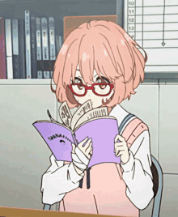
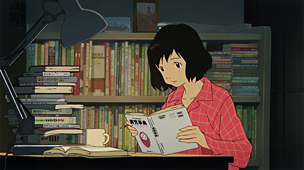

<h1 align = 'center'> Hey, I'm Hardik.  </h1>

I'm a 21 year-old Computer Science Senior looking to solve problems through code.   
<strong>I am a prospective grad student, and I am looking for research opportunities in CS!</strong>  Click on the tabs below if you wanna get to know me more.  </h1> 

<pre><h2 align = 'left'>Research</h2></pre>

 

I am an upcoming CS researcher and prospective grad student. I have more than an year of undergraduate research experience.  

In 2022-23, I worked with [Dr. Rahul Suresh, *Siberian Federal University*](http://inspeq.sfu-kras.ru/Suresh) on the applications of ML in Physics. Our paper is under review and is to be published in [*Artificial Intelligence Review*](https://www.springer.com/journal/10462). 

<h3>I'm looking for research experience in Computer Science.</h3>

My research interests are as follows :

- ***Generative AI***
    - GAN Architecture
    - Super-Resolution
    - Style Preservation
    - Video Generation
    - Procedural Generation using GANs
    - Ethics of Generative AI

- ***Reinforcement Learning***
    - Markov Decision Processes
    - Deep Reinforcement Learning
    - RL in Games and Game Design

- ***Deep Learning in Games***
    - Procedural Generation Applications
    - RL Applications in Games
    - Player Modeling
    - Multi Agent Systems

<pre><h2 align = 'left'>Tech Stack and Projects</h2></pre>

 

This section is in progress :D

<pre><h2 align = 'left'>Contact me</h2></pre>

 

<pre><h2 align = 'left'>My Stats</h2></pre>

 

